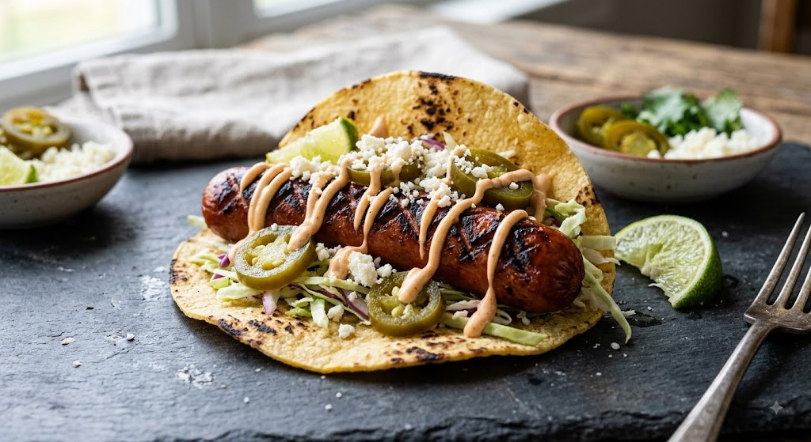

# The Biggest Wiener

A punishment cookbook. Devaraiders Fantasy Football, 2025 season.
Eight courses, one protein, every dish gluten-free.

Hosted on GitHub Pages from `main`.

## Pages

| File | What it is |
|---|---|
| `index.html` | The public reveal page. Paginated cover → contents → the courses released so far. Rebuilt as each day drops. |
| `day1.html` … `day8.html` | Cumulative recipes, one scrolling page each. `day3` contains Courses I–III in full. Recipes only — no story commentary. |
| `day9.html` | "The Morning After" — an unnumbered epilogue. Not a course. Linked only from the bottom of `day8.html`. |
| `menu1.html` … `menu8.html` | Cumulative menu galleries — dish names and photos only. Each card links to that course's recipe. |
| `menu.html` | Bare full recipe reference: all eight courses, ingredients and steps, no commentary. Unlisted — nothing links to it. |
| `recipe-review.html` | All eight recipes with photos on one page, in a light serif theme of its own. Unlisted. |
| `links.html` | Quick-links index of every shareable page. Unlisted. |
| `LINKS.md` | Markdown twin of `links.html`, with absolute URLs so the links work from the GitHub file browser. |
| `404.html` | Styled not-found page. |
| `daily.css` | Shared stylesheet for every page above except `recipe-review.html`, which is self-contained. |
| `images/` | `course1.jpg` … `course8.jpg`, plus `trophy.jpg`. |

There is also a full private edition of the book — the original paginated
flip-through, with the roast intro and all the per-course commentary intact.
It is served from an unlisted filename and is deliberately not linked from
anywhere on the site.

## Daily release

One link per day, in order:

```
day1.html   Course I      day5.html   Courses I–V
day2.html   Courses I–II  day6.html   Courses I–VI
day3.html   Courses I–III day7.html   Courses I–VII
day4.html   Courses I–IV  day8.html   Courses I–VIII
                          day9.html   epilogue, after the eighth course
```

`index.html` carries the roast intro — it is the reveal. Days 2–8 are
recipes only.

## What lives where

This matters more than anything else in this file. Content is duplicated
across pages by design, and the duplication rule is different depending on
what kind of content it is.

**Recipes** — ingredients, steps, meta strips, images — are duplicated across
every cumulative page that shows that course. A change to Course II has to
land in `day2.html` through `day8.html`, plus `menu.html`, plus
`recipe-review.html`, plus the private edition.

**Menu cards** are duplicated the same way across `menu*.html`.

**Story commentary** — the course blurbs, the "My Note" chef notes, the
table-of-contents quips, and the nutrition-facts panels — exists **only in
the private edition**. None of it appears on the day pages, `menu.html`,
`index.html` or `recipe-review.html`, and it should stay that way. Those
pages are deliberately clean.

**Drink pairings** are the exception to that rule: they're commentary in tone
but practical in purpose, so they appear under each course subtitle in the
private edition, `menu.html`, and `day1.html` through `day8.html`.

**The roast intro** lives in three places: `day1.html`, `index.html`, and the
private edition. Edit all three together.

## Images

Photos are local files, not hotlinks:

```html

```

Each dish's photo appears in its day pages, its menu cards, `menu.html`,
`recipe-review.html`, and the private edition — update them together. Social
preview tags (`og:image`) use absolute URLs of the form
`https://bkelly8004.github.io/biggest-wiener/images/courseN.jpg`.

`recipe-review.html` used to embed its images as base64 data URIs. It no
longer does, and it shouldn't again — that made the file 1.5 MB and meant
every photo swap had to happen twice.

## Privacy

- `robots.txt` disallows all crawlers; every HTML page also carries
  `<meta name="robots" content="noindex, nofollow">`
- `menu.html`, `recipe-review.html`, `links.html` and the private edition are
  unlisted — reachable by direct link only, not from any nav
- The repo is public, so anyone with a URL can read these pages. The
  protection here is against search-engine discovery, not against someone who
  has the link
- `LINKS.md` is the one exception worth knowing about: `robots.txt` and the
  noindex tags only govern `bkelly8004.github.io`, not `github.com`, so a
  markdown file listing every URL is indexable in a way the pages are not
- `CLAUDE.md` is gitignored and must stay that way — it contains real names
  and roast material
- Earlier commits still contain the roast intro on all eight day pages.
  Removing that would require rewriting history

## Style

Dark ground `#0A0A0A`, gold `#B8965A`, bone `#F2EDE4`. Playfair Display for
display type, Cormorant Garamond for body, Courier Prime for labels.
`recipe-review.html` and `links.html` deliberately break from this with a
light theme, since they're utility pages rather than part of the book.

Em dashes throughout. Don't introduce en dashes into the site's prose.
